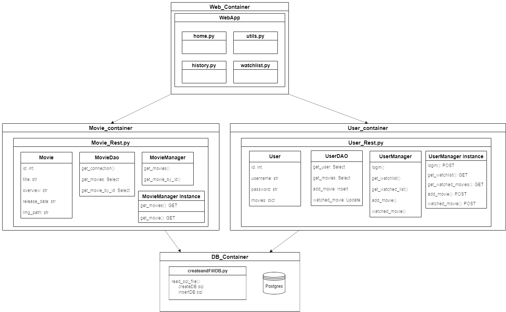

# CLC3 Project - From a Monolith to Microservices

## Project description
We built a small monolithic web application that provides an overview over a collection of movies that we got from the open-source movie database "The Movie Database (TMDB)". Users with a user account on this website are able to maintain a watchlist, which they can fill with movies from the overview list. After watching the movies they can rate them an add them to their movie history list.

As a next step the monolithic application was restructed to work as multiple microservices. Therefore, we firstly dockerized the application, meaning that the webapp, user management, movie management and database were put into seperate docker containers and the docker images were published on Docker Hub.
Further details on how the application was restructed can be found in down below.

Finally, to demonstrate that the microservices can be deployed on a cloud service, we deployed them on kubernetes using kind.

## Requirements
- Python 3.10
- Python packages defined in requirements.txt
- Docker
- kubectl
- [kind](https://kind.sigs.k8s.io/)

## Monolith 
### Architecture

The application was built with Python and SQLite, and offers a user-friendly interface for users to interact with their movie collection. The application is built of multiple python "modules", each dedicated to specific functions.

### Key Components
#### Domain.py
- Contains data classes for Movie and User.
- **Movie**: Stores information such as ID, title, overview, release date and image path.
- **User**: Holds details including ID, username, password, and a dictionary to store movies.

#### DAOs.py (Data Access Objects)
- Includes `UserDAO` and `MovieDAO` classes.
- Handles database interactions with SQLite, performing tasks like data retrieval, insertion, and updates.
  - `UserDAO`: Manages user-related data operations.
  - `MovieDAO`: Handles operations related to movie data.

#### Managers.py
- Contains `UserManager` and `MovieManager` classes.
- Utilizes DAOs for database access and provides data to the UI.
  - `UserManager`: Deals with user login, watchlist, and watched movies functionalities.
  - `MovieManager`: Responsible for retrieving movie details.

#### Web Application with Streamlit
- Uses Streamlit for creating a user-friendly web interface.
- Facilitates user interactions with the application, such as viewing movies, managing watchlists, and tracking watched movies.

#### Database

For the Monolith we opted for a sqlite database since it was easier to start with. However, for the microservices architecture we chose a PostgreSQL database to enable external access via a dedicated port.

## Microservices 
### Architecture

The biggest change from the monolithic to the microservice architecture is that now the functionality of the Users, Movies, the WebApp and the database were split up into seperate containers/python scripts. Meaning that in the Movie and User files the domain class, DAO and Manager of the respective functionality is encapsulated. To be able to communicate between the containers/scripts it was necessary to build REST API endpoints for the Movie and User containers, to use their functionality. Additionally, the communication between the DAOs and the database was adapted to use the HTTP protocol to access the data in the database.

### Database change
Instead of a SQLite database a PostgreSQL database is now used, as these can be access via HTTP and the goal was to put the database into its own container and access it there.

### Backend Services
The application consists of two main Python scripts: `Movie_Rest.py` and `User_Rest.py`.
- `Movie_Rest.py`: Handles movie-related operations.
- `User_Rest.py`: Manages user authentication and their watchlist.

### API Endpoints
#### Movie Service
- `GET /movies`: Fetch all movies.
- `GET /movie/<int:movie_id>`: Fetch a single movie by its ID.

#### User Service
- `POST /login`: Authenticate a user.
- `GET /user/<int:user_id>/watchlist`: Get a user's watchlist.
- `GET /user/<int:user_id>/watched`: Get a user's watched movies.
- `POST /user/<int:user_id>/add_movie`: Add a movie to a user's watchlist.
- `POST /user/<int:user_id>/watched_movie`: Mark a movie as watched.

## Dockerization
For  Movie, User, Web and Database seperate Dockerfiles were created. The docker-compose defines a container for each dockerfile. The Web container establishes HTTP connections with the API containers, utilizing hostnames matching the container names defined in the compose file.

The dockerfiles follow this structure: 
- using python as base image
- copying needed files
- install dependencies e.g. Flask
- set environment variables (e.g. which app flask should run)
- starting flask/streamlit on the defined port (e.g. 5001 = movies-rest)

In the database container the environments variables are the login data for the database.

Here's the overview of the launched containers and their associated ports:

### Running the microservice in docker
1. open the repository in the CLI 
2. change into the microservice/dockerization folder (`cd microservice\dockerization`)
3. Build the docker-compose: `docker compose up`
4. Open application in `localhost:8501`

To be able to use the docker images for the Kubernetes setup, the images were published on DockerHub.

## Microservices on Kubernetes
To run the microservices on Kubernetes we built on the before explained docker-compose.

To convert the docker-compose into the Kubernetes configuration files, `konvert compose` was used to built the deployment and service YAML files. These configuration files can be found in the kubernetes folder.

To finally setup and start the application in Kubernetes the following steps need to be done:
1. Open the repository in the CLI 
2. Change into the microservice/kubernetes folder (`cd microservice\kubernetes`)
3. Create a Kubernetes cluster: `kind create cluster`
4. Apply the configuration files: `kubectl apply -f .`
5. Check that deployments were created: `kubectl get deployments`
6. Check that services were created: `kubectl get svc`
7. Open port to web application: `kubectl port-forward service/web-application 8501:8501`
8. Open application in `127.0.0.1:8501`

## Summary of lessons-learned
- Not every database is suitable for microservice use when it should run in its' own container(e.g. SQLite)
- It's easier to write a docker-compose and convert it into the Kubernetes config files than to write the config files directly
- Kind is a very good alternative to GCloud or Azure if you want to deploy only small applications (small use-case)
- Setting up Kubernetes is very easy, when you have the config files
- If you have a good monolithic structure and docker knowledge it can be relativly easy to convert the monolith into a microservice application.
